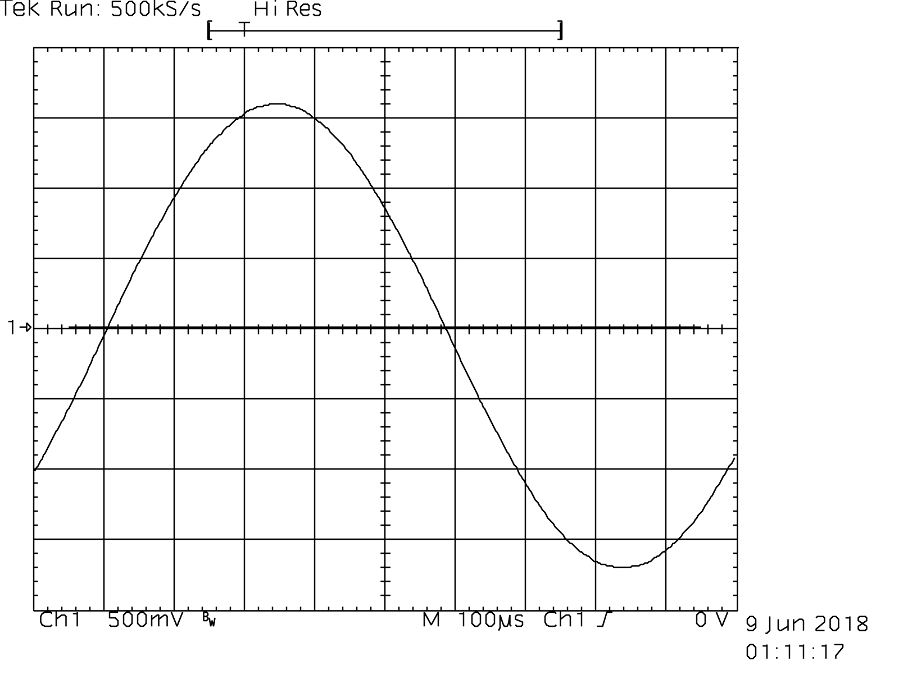

## GPIB adapter using Arduino Nano

Copyright 2018 Toby Thain `toby at telegraphics.com.au`

### Parts list

| Item | Qty | Digikey Part # |
| ---- | --- | -------------- |
| Protoboard | 1 | [SBB1605-1-ND](https://www.digikey.ca/product-detail/en/chip-quik-inc/SBB1605-1/SBB1605-1-ND/5978253) |
| IC socket 20 pin† | 2 | [ED11088-ND](https://www.digikey.ca/product-detail/en/mill-max-manufacturing-corp/110-47-320-41-001000/ED11088-ND/7363964) |
| Header 15 position | 2 | [ED11218-ND](https://www.digikey.ca/product-detail/en/mill-max-manufacturing-corp/801-47-015-10-012000/ED11218-ND/7364093) |
| Decoupling caps, ceramic 0.1µF | 2 | [BC1154CT-ND](https://www.digikey.ca/product-detail/en/vishay-bc-components/K104Z15Y5VE5TH5/BC1154CT-ND/286776) |
| Data Transceiver SN75160BN | 1 | [296-6845-5-ND](https://www.digikey.ca/product-detail/en/texas-instruments/SN75160BN/296-6845-5-ND/370217) |
| Control Transceiver SN75161BN | 1 | [296-6847-5-ND](https://www.digikey.ca/product-detail/en/texas-instruments/SN75161BN/296-6847-5-ND/370219) |
| GPIB cable | 1 | [Ebay - search](https://www.ebay.com/sch/i.html?_from=R40&_nkw=gpib+cable&_sacat=0&_sop=15)  |
| Arduino Nano compatible | 1 | [BrianPTY's Tindie store](https://www.tindie.com/products/BrianPTY/development-board-nano-v3-arduino-compatible) |
| USB Mini-B cable for Nano | 1 |
| Hookup wire | | 
| Zip tie | |

It's assumed you already have tools including solder, iron, drill, wire strippers, X-acto knife, etc.

† My version used the 22 pin DS75162AN, so if you obtain one of these (e.g. ebay) order the 22 pin socket.

| Item | Qty | Digikey Part # |
| ---- | --- | -------------- |
| IC socket 22 pin | 1 | [ED11093-ND](https://www.digikey.ca/product-detail/en/mill-max-manufacturing-corp/110-47-422-41-001000/ED11093-ND/7363969) |

### Pictures of assembled adapter

* [More images at Flickr](https://www.flickr.com/photos/qu1j0t3/40411827020/in/dateposted/)

#### Note on transceiver controlled bidirectional lines

Pull-up and pull-down resistors ensure the transceiver will read
a defined logic level while these pins are high-Z
but before transceiver direction is switched.

* D1-8 - pull up at GPIO/terminal - Arduino internal pullups can be used
* EOI  - pull up at GPIO/terminal - Arduino internal pullups can be used
* DAV  - pull up at GPIO/terminal - Arduino internal pullups can be used
* NRFD - pull down at GPIO/terminal with 22kΩ resistor to GND
* NDAC - pull down at GPIO/terminal with 22kΩ resistor to GND

### Success

Adapter fully works. For example I have been able to capture curve data and hardcopy imagery.

### Using `screen` to interact

You can connect to the adapter and send GPIB commands interactively.
Find the device name for the USB/serial port on the Arduino - e.g. check Tools->Port
in the Arduino IDE.

E.g. on my system, `screen /dev/cu.wchusbserial3d20 115200 -L` gives you a terminal
opened on that port.
* To exit `screen` but stay connected to the port, type control-`A` `d`
  * You will not be able to upload new code to the Arduino while connected
* To exit and close port, control-`A` control-`\` (and type `y` at the prompt)
* You will probably want to type `++v 1` at the start of your session
  to enable interactive features like input echo and read-after-write (`auto 1`).

      2018-07-04 GPIB/Arduino Controller by Toby Thain <toby@telegraphics.com.au>
      Use  ++v 1  for interactive session. See  ++help
    
      > ++addr 2
    
      > *idn?
      TEKTRONIX,TDS 460A,0,CF:91.1CT FV:v1.0.2e
    
      >
      
      
#### Test plan

There are test routines which can be enabled in the source.
Use them in combination with the steps below.

* Disconnect from bus
* Output test #1
    * Send square wave to TE (D13), PE (D10) output pins, verify on Arduino side - _PASS_
* Output test #2
  * Send square wave to each permanent output pin, verify on Arduino side and bus side - _PASS_
    * ATN (D12)
    * IFC (A4)
    * REN (A5)
* Input test #1
  By hand set LOW (ground through a 1K resistor for current limiting) 
  and set HIGH (VCC through a 1K resistor for current limiting), verify at Arduino
  (e.g. read input and print to serial) - _PASS_
  * SRQ
* Output test #3
  * Set TE (Talk Enable) HIGH, PE HIGH, ATN HIGH
  * Send square wave to each switchable output pin, verify on Arduino side and bus side
    * B1-8 (D2-D9) - _PASS_
    * EOI (D11) - _PASS_
    * DAV (A1) - _PASS_
* Input test #2
  * Set TE (Talk Enable) HIGH, PE HIGH, ATN HIGH
    * Verify NRFD as input - input test #2 - _PASS_
    * Verify NDAC as input - input test #2 - _PASS_
* Input test #3 
  * Set TE (Talk Enable) LOW
  * Each switchable input pin: By hand set LOW and set HIGH, verify at Arduino
    * D1-8 - _PASS_
    * EOI - _PASS_
    * DAV - _PASS_
* Output test #4
  * Set TE (Talk Enable) LOW
  * Verify NRFD (A2) as output - _PASS_
  * Verify NDAC (A3) as output - _PASS_

    This file is part of "GPIB Adapter", an Arduino based controller for GPIB (IEEE 488).
    Copyright (C) 2018 Toby Thain, toby@telegraphics.com.au

    This program is free software; you can redistribute it and/or modify
    it under the terms of the GNU General Public License as published by
    the Free Software Foundation; either version 2 of the License, or
    (at your option) any later version.

    This program is distributed in the hope that it will be useful,
    but WITHOUT ANY WARRANTY; without even the implied warranty of
    MERCHANTABILITY or FITNESS FOR A PARTICULAR PURPOSE.  See the
    GNU General Public License for more details.

    You should have received a copy of the GNU General Public License
    along with this program; if not, write to the Free Software
    Foundation, Inc., 59 Temple Place, Suite 330, Boston, MA  02111-1307  USA
